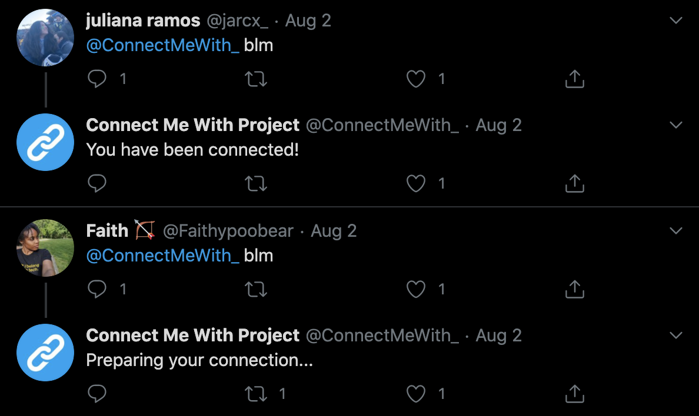
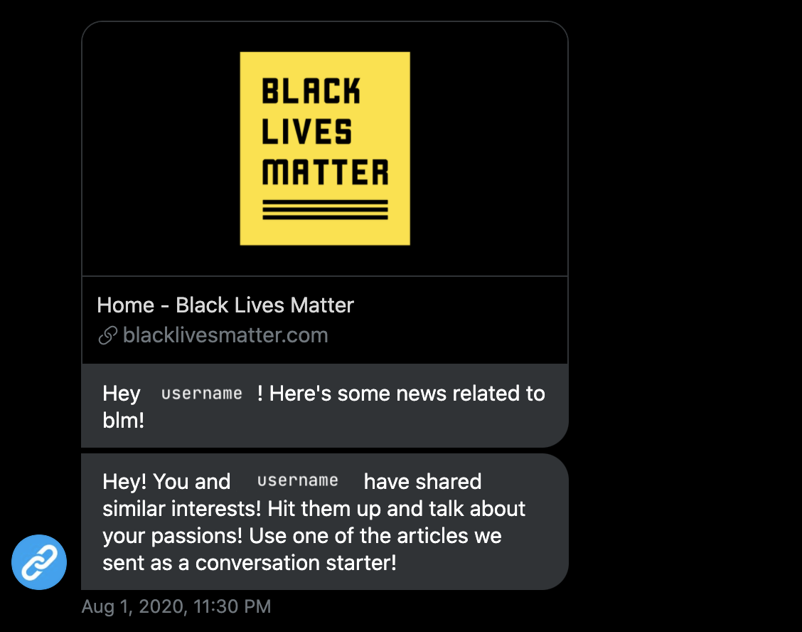

# ConnectMeWith - Team: PhoenixSankofa

### TwitterU's #BattleOfTheCamps "Twitter For Everyone" Category Winner 🎉

Team Members: [Faith](https://github.com/lavendermistyco), [Gentle](https://github.com/ramirezg-web), [James](https://github.com/jmsgrgry), [Juliana](https://github.com/julianaramoscesp), [Nadia](https://github.com/ncgo)

[DevPost](https://devpost.com/software/connectmewith)

[Website](https://connectmewithbattle.web.app/)

#### Inspiration:

Aside from being a devastating pandemic, COVID-19 has hindered our ability to connect with one another. In a time where social movements gain traction and a lack of social interaction makes social activism difficult, there’s a need to connect passionate individuals with one another. In comes ConnectMeWith.

#### What it does:

ConnectMeWith is a service that, when used by two or more users that request the same topic, connects them based on their similar interests and routinely sends them articles about their favorite social movement or topic. While a primary focus of the pairing is connecting with like-minded activists, the service is extended to connect users that share any similar interests (outside of activism). The service also has its own instructional and dynamic landing page to educate those who wish to learn about it.

#### Tools:

We used Twitter's API to build the bot, TinyDB to manage links as well as users interacting with the bot, and GoogleNews API to fetch links for topics not included in the links database already.

#### Screenshots:

##### Requesting a connection:

##### DM-ing users:

